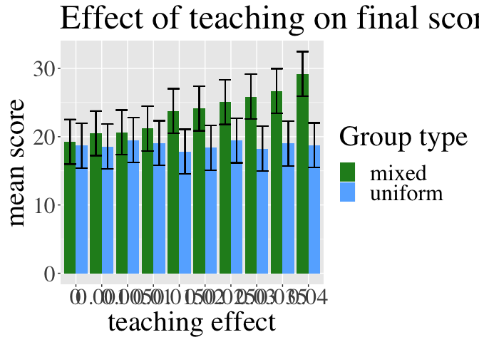
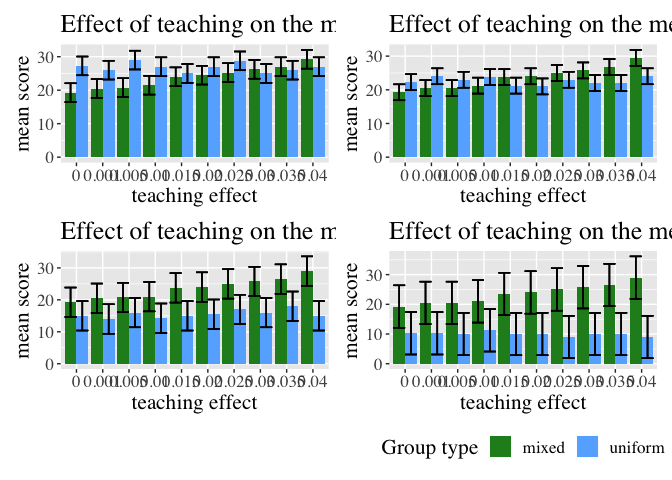
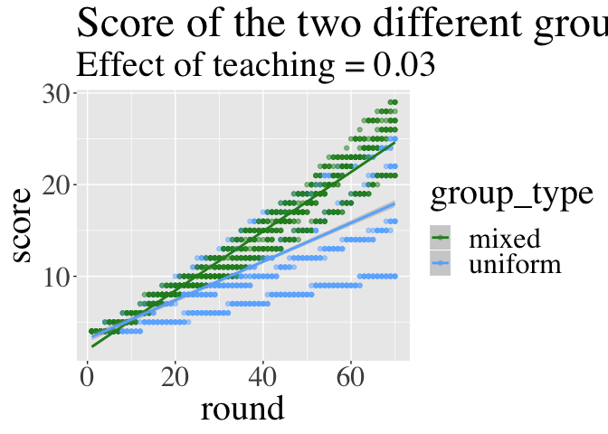
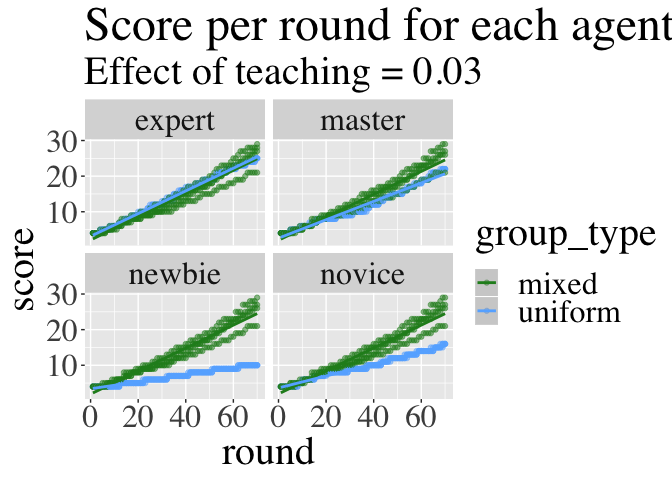
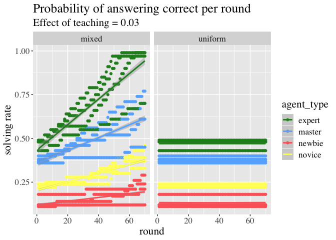

# INTRODUCTION

This script computes an Agent-Based Model in which a group of agents has
to solve a task, either in groups where they have the same level of
ability of mixed levels.

The model needs 4 fixed parameter: - N\_agents = number of agents -
rounds = number of rounds - teaching = the effect of teaching varying
from 0-0.4 When you run the model it outputs a dataframe containing the
score for each agent on every round. From this dataframe you can plot
how the agents performed given the fixed parameters.

The model uses 4 predefined functions: - simulation() - getScore() -
runTask() Each of these functions are defined below in the script along
with explanations of what they do.

# SETUP

``` r
library(pacman)
p_load(ggplot2, tidyverse, patchwork, reshape)

# to get the same result across runs.
set.seed(177)
```

# MAKING GROUPS

``` r
# We define the error rate as four different ones. 
group_n <- c(1, 2, 3, 4)
newbie <- round(c(runif(4, 0.10, 0.20)), 2)
novice <- round(c(runif(4, 0.20, 0.30)), 2)
master <- round(c(runif(4, 0.30, 0.40)), 2)
expert <- round(c(runif(4, 0.40, 0.50)), 2)

# combine it into a dataframe for mixed groups
df_mixed <- data.frame(group_n, newbie, novice, master, expert)

# We define a group_n for the similar groups with the numbers from 5-8
group_n <- c(5, 6, 7, 8)

# We make a df for same level groups
df_similar <- as.data.frame(rbind(newbie, novice, master, expert))
df_similar$group_n <- group_n
df_similar <- melt(df_similar, id.vars = c("group_n"))
df_similar$id <- seq.int(nrow(df_similar))

# We make the agent_type column
agent_type <- rep(c("newbie", "novice", "master", "expert"), 4)
# make uniform/similar groups
df_similar$variable <- agent_type
df_similar <- rename(df_similar, c("variable" = "agent_type"))

# Specify id.vars: the agent_types to keep but not split apart on
df_mixed <- melt(df_mixed, id.vars=c("group_n"))
df_mixed <- rename(df_mixed, c("variable" = "agent_type"))
df_mixed$id <- seq.int(from = 17, to = 32)
#reorder by column index
df_mixed <- df_mixed[c(4,1,3,2)]
```

# SIMULATION FUNCTION - simulation()

How the function works: - The simulation function takes the four inputs
described above.

  - Generate a dataframe containing 8 columns:

<!-- end list -->

1)  id. 2) group\_n. 3) agent\_type. 4) solving\_rate. 5) round. 6)
    score of the agent. 7) whether the agent did teach/learn. 8) The
    teaching effect for that simulation.

<!-- end list -->

  - Generate a matrix storing the guesses (combination of digits) of
    each agent in each round. The matrix has 3 dimensions (agent,
    digits, round). That is, for each round we have a 2D matrix
    containing N rows (one for each agent) and 50 columns (one for each
    digit). To index the guess of agent 3 on round 5: guesses\[3, ,5\].

  - Run loop to set op the values of the first round. For each agent,
    the loop does three things: 1) give the agent a first guess, by
    sampling 15 digits of 0 ) get the score of that guess (using the
    getScore() function) and add the score to the df, and 3) add the
    guess of the each agent to the guesses list of the first round.

  - Run learning. For each round, the loop does 3 things:
    
      - Run task and update the df and guesses matrix.
      - Calculate the mean score for the agent types and groups.
      - Return the dataframe (df) after running all rounds.

<!-- end list -->

``` r
simulation <- function(N_agents,rounds, teaching){
  
  #Create df for round number, score etc
  df <-  data.frame(id = rep(1:N_agents, rounds), round = rep(1:rounds, each = N_agents), score = NA, Teaching_or_learning = NA, teaching_effect = teaching)
  df_groups <- rbind(df_similar, df_mixed)
  df <- cbind(df, df_groups)
  df <- df[c(1,6, 7,8, 2,3,4, 5)]
  df <- rename(df, c("value" = "solving_rate"))

  
  # 3-Dimensional array to keep track of the agent's guesses - Dimensions [agent, digits, round]
  guesses = array(0,c(N_agents,50,rounds))   

  #Setup values for first round 
  for(agent in 1:N_agents){
    firstGuess <- round(runif(50, 0, 0) ,0) 
    guesses[agent,,1] <- firstGuess
    df$score[df$round==1 & df$id == agent] <- getScore(firstGuess)
  }
 ### Set up other columns in df here
  # We want a column specifying the group type
  df$group_type <- ifelse(df$group_n < 5, "mixed", "uniform")
  
  # We want a mean for each group type 
  df$mean_group[df$round==1 & df$group_n < 5] <- mean(df$score[df$round==1 & df$group_n<5])
  df$mean_group[df$round==1 & df$group_n > 4] <- mean(df$score[df$round==1 & df$group_n>4])
  
  # We want a mean for each agent_type
   df$mean_agent_type[df$round==1 & df$agent_type == "newbie" & df$group_type ==  "uniform"] <- mean(df$score[df$round==1 & df$agent_type == "newbie"  & df$group_type ==  "uniform"])
   
  df$mean_agent_type[df$round==1 & df$agent_type == "novice" & df$group_type ==  "uniform"] <- mean(df$score[df$round==1 & df$agent_type == "novice" & df$group_type ==  "uniform"])
  
  df$mean_agent_type[df$round==1 & df$agent_type == "master" & df$group_type ==  "uniform"] <- mean(df$score[df$round==1 & df$agent_type == "master" & df$group_type ==  "uniform"])
  
  df$mean_agent_type[df$round==1 & df$agent_type == "expert" & df$group_type ==  "uniform"] <- mean(df$score[df$round==1 & df$agent_type == "expert" & df$group_type ==  "uniform"])
  
  df$mean_agent_type[df$round==1 & df$agent_type == "newbie" & df$group_type ==  "mixed"] <- mean(df$score[df$round==1 & df$agent_type == "newbie"  & df$group_type ==  "mixed"])
  
  df$mean_agent_type[df$round==1 & 
                     df$agent_type == "novice" & 
                     df$group_type ==  "mixed"] <- 
    mean(df$score[df$round==1 & df$agent_type == "novice" & df$group_type ==  "mixed"])
  
  df$mean_agent_type[df$round==1 & df$agent_type == "master" & df$group_type ==  "mixed"] <-mean(df$score[df$round==1 & df$agent_type == "master" & df$group_type ==  "mixed"])
  
  df$mean_agent_type[df$round==1 & df$agent_type == "expert" & df$group_type ==  "mixed"] <- mean(df$score[df$round==1 & df$agent_type == "expert" & df$group_type ==  "mixed"])
  
  #Run learning
  for(round in 2:rounds){

    task <- runTask(df, guesses, round, N_agents, teaching)
    df <- task$df
    guesses <- task$guesses

     # We want a mean for each group type 
  df$mean_group[df$round==round & df$group_n < 5] <- mean(df$score[df$round==round & df$group_n<5])
  df$mean_group[df$round==round & df$group_n > 4] <- mean(df$score[df$round==round & df$group_n>4])
  
  # We want a mean for each agent_type
  df$mean_agent_type[df$round==round & 
                     df$agent_type == "newbie" & df$group_type ==  "uniform"] <- 
    mean(df$score[df$round==round & 
                    df$agent_type == "newbie" & df$group_type ==  "uniform"])
  df$mean_agent_type[df$round==round 
                   & df$agent_type == "novice" & df$group_type ==  "uniform"] <- 
    mean(df$score[df$round==round & 
                    df$agent_type == "novice" & df$group_type ==  "uniform"])
  df$mean_agent_type[df$round==round & 
                     df$agent_type == "master" & df$group_type ==  "uniform"] <- 
    mean(df$score[df$round==round & 
                    df$agent_type == "master" & df$group_type ==  "uniform"])
  df$mean_agent_type[df$round==round & 
                     df$agent_type == "expert" & df$group_type ==  "uniform"] <- 
    mean(df$score[df$round==round & 
                    df$agent_type == "expert" & df$group_type ==  "uniform"])
   df$mean_agent_type[df$round==round & 
                      df$agent_type == "newbie" & df$group_type ==  "mixed"] <- 
    mean(df$score[df$round==round & 
                    df$agent_type == "newbie"  & df$group_type ==  "mixed"])
  df$mean_agent_type[df$round==round & df$agent_type == "novice" & df$group_type ==  "mixed"] <- 
    mean(df$score[df$round==round & df$agent_type == "novice" & df$group_type ==  "mixed"])
  df$mean_agent_type[df$round==round & df$agent_type == "master" & df$group_type ==  "mixed"] <- 
    mean(df$score[df$round==round & df$agent_type == "master" & df$group_type ==  "mixed"])
  df$mean_agent_type[df$round==round & df$agent_type == "expert" & df$group_type ==  "mixed"] <- 
    mean(df$score[df$round==round & df$agent_type == "expert" & df$group_type ==  "mixed"])
  
  # We want a mean endscore for all hetero and all homo groups
  df$mean_endscore[df$group_n < 5 & df$round == round] <- 
    mean(df$score[df$group_n<5 & df$round == rounds])
  df$mean_endscore[df$group_n > 4 & df$round == round] <- 
    mean(df$score[df$group_n>4 & df$round == rounds])
  }
  
  return(df)
}
```

# Task FUNCTION - runTask()

How the function works: - It takes the df, guesses, round and N\_agents
as input - Loop through all groups - Loop through all the agents in each
group - Create a new df containing only the values from the previous
round. - Extract the previous score of that agent - Extract the previous
guess from that agent - Find the best scoring agent - For mixed groups:
- If yourself, you gain a higher probability of matching the string, but
don’t get to change a digit - For uniform groups: - If yourself, you can
change a digit in your string - If another you take his/her guess and
change one incorrect number - If all of you have the best guess, all
change one incorrect number - Compute the score of the new guess - Add
the new score to the df - Add the new guess to the guesses matrix -
Return the updated df and guesses matrix

``` r
#Function to run tasks
runTask <- function(df, guesses, round, N_agents, teaching){
  for (group in 1:length(unique(df$group_n))){
    df_group <- subset(df, group_n == group)
    for (i in 1:length(unique(df_group$id))){ # 
      prevRound <- df_group[df_group$round==round-1,]
      prevScore <- prevRound$score[i] 
      prevGuess <- guesses[prevRound$id[i],,round-1]
      # Draw random number between 0-9 for each group member only for i = 1
      if(i == 1) {
          draw_uncertainty <- c(sample(0:9,4, replace=TRUE))
          # Save teaching/learning as no if the number is 9 for each agent 
          prevRound$Teaching_or_learning[i] <- ifelse(draw_uncertainty[1] == 9, 
                                                      "No", "Yes")
          prevRound$Teaching_or_learning[i+1] <- ifelse(draw_uncertainty[2] == 9, 
                                                      "No", "Yes")
          prevRound$Teaching_or_learning[i+2] <- ifelse(draw_uncertainty[3] == 9, 
                                                      "No", "Yes")
          prevRound$Teaching_or_learning[i+3] <- ifelse(draw_uncertainty[4] == 9, 
                                                      "No", "Yes")
          # Save it to the overall df
          df$Teaching_or_learning[df$round == round-1 & 
                 df$id == prevRound$id[i] & 
                 df$group_n == group] <- prevRound$Teaching_or_learning[i]
          
          df$Teaching_or_learning[df$round == round-1 & 
                 df$id == prevRound$id[i+1] & 
                 df$group_n == group] <- prevRound$Teaching_or_learning[i+1]
          
          df$Teaching_or_learning[df$round == round-1 & 
                 df$id == prevRound$id[i+2] & 
                 df$group_n == group] <- prevRound$Teaching_or_learning[i+2]
          df$Teaching_or_learning[df$round == round-1 & 
                 df$id == prevRound$id[i+3] & 
                 df$group_n == group] <- prevRound$Teaching_or_learning[i+3]
          
          #Save it to the df_group
          df_group$Teaching_or_learning[df_group$round == round-1 & 
                 df_group$id == prevRound$id[i]] <- prevRound$Teaching_or_learning[i]
          
          df_group$Teaching_or_learning[df_group$round == round-1 & 
                 df_group$id == prevRound$id[i+1]] <- prevRound$Teaching_or_learning[i+1]
          
          df_group$Teaching_or_learning[df_group$round == round-1 & 
                 df_group$id == prevRound$id[i+2]] <- prevRound$Teaching_or_learning[i+2]
          df_group$Teaching_or_learning[df_group$round == round-1 & 
                 df_group$id == prevRound$id[i+3]] <- prevRound$Teaching_or_learning[i+3]
            
      }
      # check whether you should cooperate or work individually
      if (prevRound$Teaching_or_learning[i] == "No"){ # 10% of times agents do individual learning
            # Use your own previous guess
            newGuess <- prevGuess 
           
            # Change numbers that is not matching with target string
            stop <- 0
            k <- 1
            while (stop == 0){
              if (newGuess[k] != target_string[k]){
                Diff <- target_string - newGuess
                  if (Diff[k] > 0){
                  prevGuess_k <- newGuess[k] + rbinom(1, Diff[k], prevRound$solving_rate[i])
                  }
                  else { 
                    sqrt((Diff[k])^2)
                    prevGuess_k <- newGuess[k] - rbinom(1, Diff[k], prevRound$solving_rate[i])
                  }
                # They slowly get closer to the target solving_rate for each round. 
                newGuess[k] <- prevGuess_k
                stop <- 1
                } # changes a number in the string --> stops --> next round 
              else{ # If guess[k] = target[k] then it takes k + 1
                k = k+1 # Next number in the guess
              }
              }
          }
      else{ # The other 90% of the time they will cooperate

          #The code finds the guess of the best members (highest score) in previous round
            # We need to use the highest score of member you have a "yes" in teaching or learning
        # A max score df for everyone cooperating or not to use for the next if statement
            all_score <- subset(prevRound, prevRound$score == max(prevRound$score))
            maxScore_df <- as.data.frame(
              subset(prevRound, Teaching_or_learning == "Yes"))
            maxScore_df <- subset(maxScore_df, maxScore_df$score == max(maxScore_df$score))
          
            # Takes out one row of max scores in case of multiple
            maxScore <- maxScore_df[sample(nrow(maxScore_df), 1), ]
   
          # if you have the highest score last time and if not all members have it and you are a mixed group
            if(prevRound$group_n[i] <= 4 &
               nrow(all_score) < 4 & 
               maxScore$score == prevRound$score[i]){
              newGuess <- prevGuess 
          # Means you wait till everyone has the same as you. 
          ## The effect of teaching
          # We will overwrite the solving_rate (error rate) for this agent like +0.01
              if (prevRound$solving_rate[i] + teaching < 1){
              for (error_round in round:rounds) {
                df$solving_rate[df$id == prevRound$id[i] &
                           df$round == error_round &
                           df$group_n == group] <- prevRound$solving_rate[i] + teaching
              }
              }
              else {
                prevRound$solving_rate[i] == 1
                }
          }
          #If you did not score highest you will use the highest scoring guess
            else if (maxScore$score > prevRound$score[i]){
          #Use the guess of the best scoring agent 
              newGuess <- guesses[maxScore$id,,round-1] #Index the guess of the best agent
            }
            # If you did score the max then you will optimize by changing a number in your guess
            # Change numbers that is not matching with target string
            else {
              newGuess <- prevGuess
              stop <- 0
              k <- 1
              while (stop == 0){
                if (newGuess[k] != target_string[k]){
                  Diff <- target_string - newGuess
                  if (Diff[k] > 0){
                  prevGuess_k <- newGuess[k] + rbinom(1, Diff[k], prevRound$solving_rate[i])
                  }
                  else { 
                    sqrt((Diff[k])^2)
                    prevGuess_k <- newGuess[k] - rbinom(1, Diff[k], prevRound$solving_rate[i])
                  }
                 # They slowly get closer to the target solving_rate for each round. 
                  newGuess[k] <- prevGuess_k
                  stop <- 1
                  } # changes a number in the string --> stops --> next round 
                else{ # If guess[k] = target[k] then it takes k + 1
                  k = k+1 # Next number in the guess
              }
              }
          }
          }
          # We save a score for the new guess
          score <- getScore(newGuess)
          #We save the newguess into the guesses matrix 
          guesses[prevRound$id[i],,round] <- newGuess # newGuess into the guesses matrix
          # Save it to the overall df
          df$score[df$round == round & 
                 df$id == prevRound$id[i] & 
                 df$group_n == group] <- score
        }
    }
  output <- list(df=df, guesses=guesses)
  return(output)
}
```

# GET SCORE FUNCTION - getScore()

How the function works: - It takes a guess (list of 50 digits) as input
- Set the score to 0 - Loop through each of the 50 digits: - If the
digit is equal to the same digit in the target string, then add 1 to the
score. - If not, do nothing, and continue with the next digit. - Return
the score.

``` r
#Function to calculate score 
getScore <- function(guess){
  score = 0
  for(i in 1:50){
    if(guess[i] == target_string[i]){
      score = score+1
      i = i+1
    }
  }
  return(score)
}
```

# RUN SIMULATION

  - First, we setup the task. The task is defined as a string of 50
    digtis between 0 and 9. The agents have to figure out the correct
    combination of digits. On every round, they produce one guess.

  - Second, we run a simulation using the simulation() function. The
    simulation function takes 4 inputs: N\_agents = number of agents,
    rounds = number of rounds, effect of teaching. The function outputs
    a dataframe, containing the performance of each agent on each round.

<!-- end list -->

``` r
#Setup task 
target_string = c(sample(0:9,50, replace=TRUE))

# Run simulation
Class_000 <- simulation(
  N_agents <- 32,
  rounds <- 70, # Can be changed
  teaching <- 0.00 # Can be changed 
)

# Run simulation
Class_001 <- simulation(
  N_agents <- 32,
  rounds <- 70, # Can be changed
  teaching <- 0.001 # Can be changed 
)

# Run simulation
Class_005 <- simulation(
  N_agents <- 32,
  rounds <- 70, # Can be changed
  teaching <- 0.005 # Can be changed 
)

# Run simulation
Class_01 <- simulation(
  N_agents <- 32,
  rounds <- 70, # Can be changed
  teaching <- 0.01 # Can be changed 
)

# Run simulation
Class_015 <- simulation(
  N_agents <- 32,
  rounds <- 70, # Can be changed
  teaching <- 0.015 # Can be changed 
)

# Run simulation
Class_02 <- simulation(
  N_agents <- 32,
  rounds <- 70, # Can be changed
  teaching <- 0.020 # Can be changed 
)

# Run simulation
Class_025 <- simulation(
  N_agents <- 32,
  rounds <- 70, # Can be changed
  teaching <- 0.025 # Can be changed 
)

# Run simulation
Class_03 <- simulation(
  N_agents <- 32,
  rounds <- 70, # Can be changed
  teaching <- 0.03 # Can be changed 
)

# Run simulation
Class_035 <- simulation(
  N_agents <- 32,
  rounds <- 70, # Can be changed
  teaching <- 0.035 # Can be changed 
)

# Run simulation
Class_04 <- simulation(
  N_agents <- 32,
  rounds <- 70, # Can be changed
  teaching <- 0.04 # Can be changed 
)
```

# PLOT RESULTS

``` r
#Combine data 
all_data <- rbind(Class_000, Class_001, Class_005, Class_01, Class_015, Class_02, Class_025, Class_03, Class_035, Class_04 ) 
all_data$teaching_effect <- as.factor(all_data$teaching_effect)

####### DESCRIPTIVE STATS #######
# We filter out the data with teaching effect == 0.03
Class <- filter(all_data, teaching_effect == 0.03)
# We filter out the last round
C <- filter (Class, round == 70)
# We calculate mean for last round in the two groups
mean(C$score[C$group_type == "uniform"])
```

    ## [1] 18.25

``` r
mean(C$score[C$group_type == "mixed"])
```

    ## [1] 25.875

``` r
sd(C$score[C$group_type == "mixed"])
```

    ## [1] 3.095696

``` r
sd(C$score[C$group_type == "uniform"])
```

    ## [1] 5.94979

``` r
# figure 3
mix <- filter(Class, group_type == "mixed")
uni <- filter(Class, group_type == "uniform")
model_uni <- lm(score ~ round, data = uni)
model_mix <- lm(score ~ round, data = mix)
# betas and sd
summary(model_uni) 
```

    ## 
    ## Call:
    ## lm(formula = score ~ round, data = uni)
    ## 
    ## Residuals:
    ##     Min      1Q  Median      3Q     Max 
    ## -7.9333 -1.8764  0.0793  1.6692  7.2775 
    ## 
    ## Coefficients:
    ##             Estimate Std. Error t value Pr(>|t|)    
    ## (Intercept) 3.180978   0.199225   15.97   <2e-16 ***
    ## round       0.210747   0.004877   43.21   <2e-16 ***
    ## ---
    ## Signif. codes:  0 '***' 0.001 '**' 0.01 '*' 0.05 '.' 0.1 ' ' 1
    ## 
    ## Residual standard error: 3.298 on 1118 degrees of freedom
    ## Multiple R-squared:  0.6255, Adjusted R-squared:  0.6251 
    ## F-statistic:  1867 on 1 and 1118 DF,  p-value: < 2.2e-16

``` r
summary(model_mix) 
```

    ## 
    ## Call:
    ## lm(formula = score ~ round, data = mix)
    ## 
    ## Residuals:
    ##     Min      1Q  Median      3Q     Max 
    ## -3.7332 -0.8541  0.1368  1.0251  4.7109 
    ## 
    ## Coefficients:
    ##             Estimate Std. Error t value Pr(>|t|)    
    ## (Intercept) 1.984006   0.098511   20.14   <2e-16 ***
    ## round       0.323262   0.002412  134.04   <2e-16 ***
    ## ---
    ## Signif. codes:  0 '***' 0.001 '**' 0.01 '*' 0.05 '.' 0.1 ' ' 1
    ## 
    ## Residual standard error: 1.631 on 1118 degrees of freedom
    ## Multiple R-squared:  0.9414, Adjusted R-squared:  0.9414 
    ## F-statistic: 1.797e+04 on 1 and 1118 DF,  p-value: < 2.2e-16

``` r
model_uni <- summary(model_uni) 
model_uni$coefficients[1, 2] * sqrt(70)
```

    ## [1] 1.666838

``` r
model_mix <- summary(model_mix)
model_mix$coefficients[1, 2] * sqrt(70)
```

    ## [1] 0.8242058

``` r
# We find the regression for the last plot / figure 5
prob_score_exp <- Class_03 %>% filter(group_type == "mixed")
model_exp <- lm(solving_rate ~ 0 + round, data = prob_score_exp[prob_score_exp$agent_type == "expert",])
summary(model_exp)
```

    ## 
    ## Call:
    ## lm(formula = solving_rate ~ 0 + round, data = prob_score_exp[prob_score_exp$agent_type == 
    ##     "expert", ])
    ## 
    ## Residuals:
    ##      Min       1Q   Median       3Q      Max 
    ## -0.45531 -0.03849  0.11055  0.27969  0.47350 
    ## 
    ## Coefficients:
    ##        Estimate Std. Error t value Pr(>|t|)    
    ## round 0.0165044  0.0003448   47.87   <2e-16 ***
    ## ---
    ## Signif. codes:  0 '***' 0.001 '**' 0.01 '*' 0.05 '.' 0.1 ' ' 1
    ## 
    ## Residual standard error: 0.2356 on 279 degrees of freedom
    ## Multiple R-squared:  0.8915, Adjusted R-squared:  0.8911 
    ## F-statistic:  2292 on 1 and 279 DF,  p-value: < 2.2e-16

``` r
model_mas <- lm(solving_rate ~ 0 + round, data = prob_score_exp[prob_score_exp$agent_type == "master",])
summary(model_mas)
```

    ## 
    ## Call:
    ## lm(formula = solving_rate ~ 0 + round, data = prob_score_exp[prob_score_exp$agent_type == 
    ##     "master", ])
    ## 
    ## Residuals:
    ##      Min       1Q   Median       3Q      Max 
    ## -0.33908 -0.02667  0.09837  0.21928  0.38873 
    ## 
    ## Coefficients:
    ##        Estimate Std. Error t value Pr(>|t|)    
    ## round 0.0112725  0.0002796   40.32   <2e-16 ***
    ## ---
    ## Signif. codes:  0 '***' 0.001 '**' 0.01 '*' 0.05 '.' 0.1 ' ' 1
    ## 
    ## Residual standard error: 0.1911 on 279 degrees of freedom
    ## Multiple R-squared:  0.8535, Adjusted R-squared:  0.853 
    ## F-statistic:  1626 on 1 and 279 DF,  p-value: < 2.2e-16

``` r
model_nov <- lm(solving_rate ~ 0 + round, data = prob_score_exp[prob_score_exp$agent_type == "novice",])
summary(model_nov)
```

    ## 
    ## Call:
    ## lm(formula = solving_rate ~ 0 + round, data = prob_score_exp[prob_score_exp$agent_type == 
    ##     "novice", ])
    ## 
    ## Residuals:
    ##      Min       1Q   Median       3Q      Max 
    ## -0.14385 -0.02193  0.03661  0.12888  0.23323 
    ## 
    ## Coefficients:
    ##        Estimate Std. Error t value Pr(>|t|)    
    ## round 0.0067693  0.0001529   44.26   <2e-16 ***
    ## ---
    ## Signif. codes:  0 '***' 0.001 '**' 0.01 '*' 0.05 '.' 0.1 ' ' 1
    ## 
    ## Residual standard error: 0.1045 on 279 degrees of freedom
    ## Multiple R-squared:  0.8753, Adjusted R-squared:  0.8749 
    ## F-statistic:  1959 on 1 and 279 DF,  p-value: < 2.2e-16

``` r
model_new <- lm(solving_rate ~ 0 + round, data = prob_score_exp[prob_score_exp$agent_type == "newbie",])
summary(model_new)
```

    ## 
    ## Call:
    ## lm(formula = solving_rate ~ 0 + round, data = prob_score_exp[prob_score_exp$agent_type == 
    ##     "newbie", ])
    ## 
    ## Residuals:
    ##      Min       1Q   Median       3Q      Max 
    ## -0.13324 -0.01110  0.02826  0.07659  0.17638 
    ## 
    ## Coefficients:
    ##        Estimate Std. Error t value Pr(>|t|)    
    ## round 0.0036177  0.0001011   35.78   <2e-16 ***
    ## ---
    ## Signif. codes:  0 '***' 0.001 '**' 0.01 '*' 0.05 '.' 0.1 ' ' 1
    ## 
    ## Residual standard error: 0.06912 on 279 degrees of freedom
    ## Multiple R-squared:  0.821,  Adjusted R-squared:  0.8204 
    ## F-statistic:  1280 on 1 and 279 DF,  p-value: < 2.2e-16

``` r
# extract SD: Sd = se * sqrt(simulationsN) for last plot
model_exp <- summary(model_exp) 
model_exp$coefficients[, 2] * sqrt(70)
```

    ## [1] 0.002884398

``` r
model_mas <- summary(model_mas)
model_mas$coefficients[, 2] * sqrt(70)
```

    ## [1] 0.002339181

``` r
model_nov <- summary(model_nov)
model_nov$coefficients[, 2] * sqrt(70)
```

    ## [1] 0.0012796

``` r
model_new <- summary(model_new)
model_new$coefficients[, 2] * sqrt(70)
```

    ## [1] 0.0008460552

``` r
####### PLOTS FOR RESULT SECTION #######

# We want to see how the effect of teaching changes the endscore
ggplot(all_data[all_data$round == 70,], aes(x = teaching_effect, y = mean_endscore, fill = group_type)) + 
  geom_bar(stat = "identity", position = "dodge") + 
  geom_errorbar(aes(x=teaching_effect, ymin=mean_endscore-sd(mean_endscore), ymax=mean_endscore+sd(mean_endscore)), position = "dodge") +
  labs(title = "Effect of teaching on final score") +
  xlab ("teaching effect") + ylab ("mean score") +
  labs(fill = "Group type") +
  theme(text=element_text(size=30,  family="serif")) + 
  scale_fill_manual(values = c( "forestgreen", "#66B2FF"))
```

<!-- -->

``` r
# seperate for each agent type
experts <- ggplot(all_data[all_data$agent_type == "expert" & all_data$round == 70,], aes(x = teaching_effect, y = mean_agent_type, fill = group_type)) + geom_bar(stat = "identity", position = "dodge") + 
  geom_errorbar(aes(x=teaching_effect, ymin=mean_agent_type-sd(mean_agent_type), ymax=mean_agent_type+sd(mean_agent_type)), position = "dodge") +
  labs(title = "Effect of teaching on the mean score for experts") + 
  xlab ("teaching effect") + ylab ("mean score") + 
  theme(text=element_text(size=16,  family="serif")) + 
  scale_fill_manual(values = c( "forestgreen", "#66B2FF")) 

newbies <- ggplot(all_data[all_data$agent_type == "newbie"& all_data$round == 70,], aes(x = teaching_effect, y = mean_agent_type, fill = group_type)) + geom_bar(stat = "identity", position = "dodge") + 
  geom_errorbar(aes(x=teaching_effect, ymin=mean_agent_type-sd(mean_agent_type), ymax=mean_agent_type+sd(mean_agent_type)), position = "dodge") +
  labs(title = "Effect of teaching on the mean score for newbies") + 
  xlab ("teaching effect") + ylab ("mean score") +
  theme(text=element_text(size=16,  family="serif")) + 
  scale_fill_manual(values = c( "forestgreen", "#66B2FF"))

novices <- ggplot(all_data[all_data$agent_type == "novice" & all_data$round == 70,], aes(x = teaching_effect, y = mean_agent_type, fill = group_type)) + geom_bar(stat = "identity", position = "dodge") + 
  geom_errorbar(aes(x=teaching_effect, ymin=mean_agent_type-sd(mean_agent_type), ymax=mean_agent_type+sd(mean_agent_type)), position = "dodge") +
  labs(title = "Effect of teaching on the mean score for novices") + 
  xlab ("teaching effect") + ylab ("mean score") +
  theme(text=element_text(size=16,  family="serif")) + 
  scale_fill_manual(values = c( "forestgreen", "#66B2FF"))

masters <- ggplot(all_data[all_data$agent_type == "master" & all_data$round == 70,], aes(x = teaching_effect, y = mean_agent_type, fill = group_type)) + geom_bar(stat = "identity", position = "dodge") + 
  geom_errorbar(aes(x=teaching_effect, ymin=mean_agent_type-sd(mean_agent_type), ymax=mean_agent_type+sd(mean_agent_type)), position = "dodge") +
  labs(title = "Effect of teaching on the mean score for masters") + 
  xlab ("teaching effect") + ylab ("mean score") +
  theme(text=element_text(size=16,  family="serif")) + 
  scale_fill_manual(values = c( "forestgreen", "#66B2FF"))

experts + theme(legend.position = "none") + masters +  theme(legend.position = "none") + novices + theme(legend.position = "none") + newbies + theme(legend.position = "bottom") + labs(fill = "Group type") 
```

<!-- -->

``` r
# We want to plot overall score per each round seperately for homo and hetero groups
ggplot(Class_03, aes(
  x = round, y = score, color = group_type)) + 
  geom_point(alpha=I(0.5)) + 
  geom_smooth(method = "lm") +
  labs(title = "Score of the two different groups per round",  
       subtitle = "Effect of teaching = 0.03") + ylab("score") +
  theme(text=element_text(size=30,  family="serif")) + 
  scale_color_manual(values = c( "forestgreen", "#66B2FF"))
```

<!-- -->

``` r
# We want to plot the overall score for each agent_type per group
ggplot(Class_03, aes(round, score, color = group_type)) + 
  geom_point(alpha=I(0.5)) + geom_smooth(method = "lm") + facet_wrap(~agent_type)  + 
  labs(title = "Score per round for each agent type", subtitle = "Effect of teaching = 0.03" ) +  
  ylab ("score") +
  theme(text=element_text(size=30,  family="serif")) + 
  scale_color_manual(values = c( "forestgreen", "#66B2FF"))
```

<!-- -->

``` r
# development in probability score
ggplot(Class_03, aes(x = round, y = solving_rate, color = agent_type)) + 
  geom_point() + facet_grid(~group_type) + 
  geom_smooth(method = "lm") +
  labs(title = "Probability of answering correct per round", subtitle = "Effect of teaching = 0.03") +
  ylab("solving rate") +
  labs(fill = "Agent type") +
  theme(text=element_text(size=16,  family="serif")) + 
  scale_color_manual(values = c( "forestgreen", "#66B2FF", "#FF6666", "#FFFF66"))
```

<!-- -->
